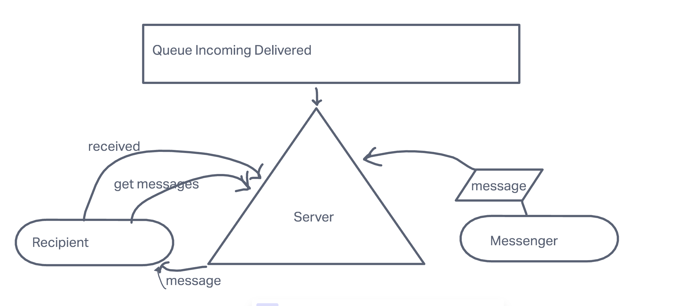

# message-queues
lab 13 401d46

## Lab: 13  message-queues

### Authentication Server Phase 2: Token (Bearer) Authentication

### Author: Michael Campbell

#### Description: 
-  A system to guarantee that notification payloads are read by their intended subscriber. 
- Rather than just triggering an event notification and hope that client applications respond, we're going to implement a "Queue" system so that nothing gets lost. 
- Every event sent will be logged and held onto by the server until the intended recipient acknowledges that they received the message. At any time, a subscriber can get all of the messages they might have missed.

#### Links:
[Heroku]()

[repo](https://github.com/MichaelCampbell-on3001/message-queues)

#### Pull Request
[Basic Auth Pull Request]()

#### USED SQLite

### Setup
**Dependencies:**
- dotenv
- express
- jest
- nodemon
- supertest
- sequelize
- sequelizeCLI
- sqlite3
- base64
- bCrypt

#### Running the app
- npm start
- Endpoint/ error status
      - Return error message

#### Tests
- Server Test `npm run test`
- 
- 

#### UML
(created with [invisionApp](https://invisionapp.com/) )

